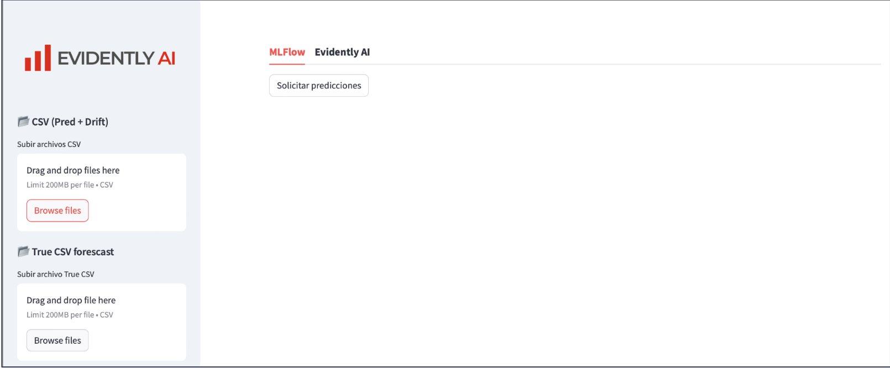
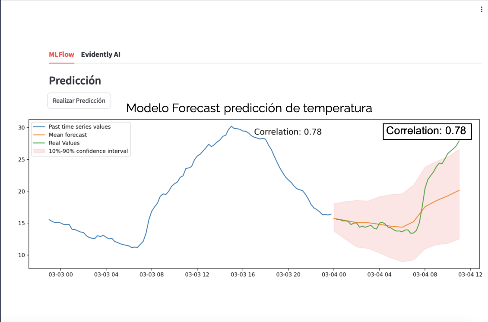
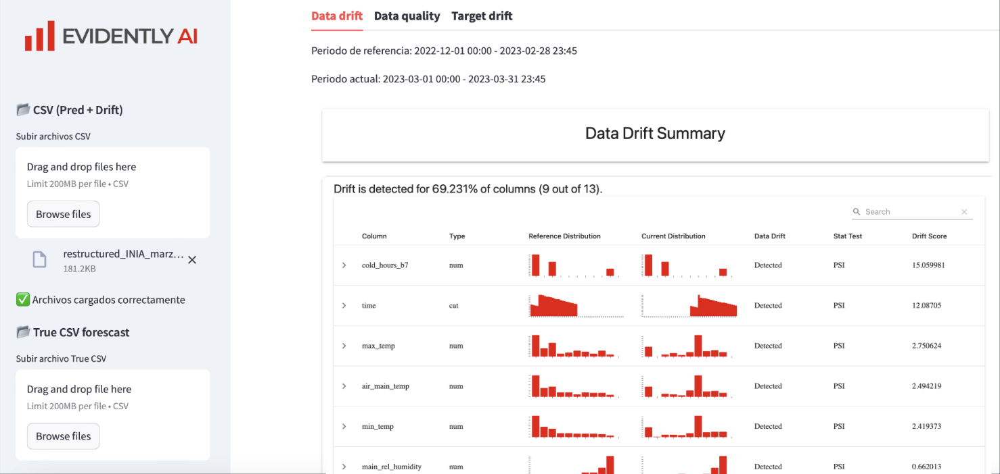
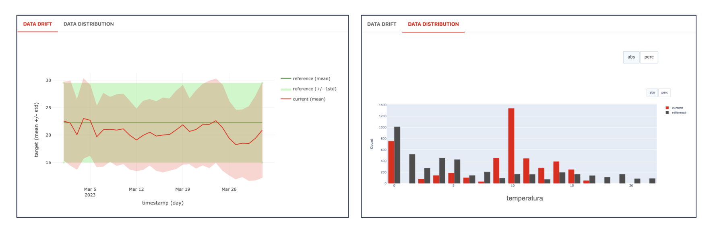

# Repositorio pasantía Manuel Blanco - Inria Chile

## Introducción
En este repositorio se encuentran los codigos implementados durante mi pasantía en [Inria Chile.](https://www.inria.cl/es)

En el siguiente [directorio](streamlit_dashboard/streamlit-app) se encuentra la plataforma implementada utilizando [Streamlit](https://streamlit.io) que corresponde a una interfaz de usuario para solicitar y visualizar predicciones y correlaciones de un modelo desplegado en [MLflow](https://mlflow.org). La app permite cargar un dataset y ver los resultados de la predicción de series de tiempo en un grafico.

La app también cuenta con la integración de la herramienta [Evidently AI](https://evidentlyai.com), que ofrece tableros y graficos estadísticos para el monitoreo de datos y modelos de machine learning. En particular, la app incluye funcionalidades para Drift de Datos, Calidad de Datos y Target Drift, ayudando en la evaluación del rendimiento del modelo y la integridad de los datos a lo largo del tiempo.

Para el efectivo funcionamiento de la plataforma es necesario contar con los siguiente:
- Modelo desplegado en MLFlow
- Dataset de entrada para solicitar predicciones
- Dataset con los datos reales para comparar la predicción (No obligatorio)
- Dataset para comparar con entrenamiento y revisar Drift.

Como el modelo fue cargado utilizando el servidor de Inria, en estos momentos no es posible solicitar predicciones al modelo del codigo.

## Agradecimientos

Agrazdezco a Inria Chile por darme la oportunidad de realizar mi pasantíab y en particular agradezco a mi tutor Rayner de Ruyt por todos los aprendizajes entregados durante los dos meses de pasantía.
